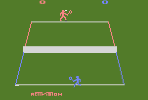

# Projeto FP
## FP/L.EIC, 2021/22
## João Miguel de Castro Figueiredo (up202108829)
## 1L.EIC08

### Objetivo

1. Criar um clone do jogo clássico Tennis (Atari 2600) em Pygame.

### Repositório de código

1) Link para o repositório do GitHub: https://github.com/joaofeup/PROJETO-FP-TENNIS

#### Código à data:

import pygame

screen=pygame.display.set_mode((1200,800))

pygame.display.set_caption("Tennis")

fundo=pygame.image.load("fundo.png")

blue=pygame.image.load("blue.png")

red=pygame.image.load("red.png")

vel=5

xr=350

yr=150

xb=575

yb=600

run = True
    
while run:
    for event in pygame.event.get():
       
        if event.type == pygame.QUIT:
            run = False
        
        
    keys= pygame.key.get_pressed()

    if keys[pygame.K_LEFT]:
        xr -= vel
        

    if keys[pygame.K_RIGHT]:
        xr += vel
        

    if keys[pygame.K_UP]:
        yr -= vel

    if keys[pygame.K_DOWN]:
        yr += vel
        
    if keys[pygame.K_a]:
        xb -= vel

    if keys[pygame.K_d]:
        xb += vel
        #pygame.transform.split(red,True,False)

    if keys[pygame.K_w]:
        yb -= vel

    if keys[pygame.K_s]:
        yb += vel

    screen.blit(fundo,(0,0))
    screen.blit(blue,(xb,yb))
    screen.blit(red,(xr,yr))
    pygame.display.flip()
    pygame.display.update() 

        
pygame.quit()

### Descrição

'Tennis', da consola Atari 2600, é um jogo que replica, tal como o nome indica, uma partida de ténis.

### UI

### Pacotes

- Pygame

### Tarefas

- Fazer o jogo para 2 jogadores (um joga no WASD  e outro nas setas).

- Fazer com que cada jogador se posicione sempre com a raquete para o lado da bola.

- (Movimento das pernas e da raquete)

- Adicionar efeitos sonoros à bola a bater no chão, na raquete e quando alguém marca ponto.

- Apontar o resultado (jogo normal, sem sets, com  apontuação regulamentada de xadrez (15-30-40-vitoria, vantagem por dois)

                                                                                      Atualizado a última vez em 04/01/2022
